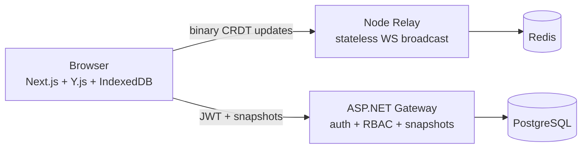

# Orbit Workspace Engine

Local-first, distributed workspace builder using Y.js CRDTs, a stateless Node.js WebSocket relay, and an ASP.NET Core gateway.

## For AI agents

- **ChatGPT 5.6:** Start with [`CHATGPT56.md`](CHATGPT56.md)
- **Fable 5 / Cursor:** Start with [`FABLE5.md`](FABLE5.md)
- **All agents:** Read [`AGENTS.md`](AGENTS.md) then [`plan/architecture-orbit-workspace-engine-1.md`](plan/architecture-orbit-workspace-engine-1.md)

## Status

Phases 1–3 complete (local-first canvas, WebSocket relay, ASP.NET gateway). Phase 4 adds Docker images and CI/CD.

## Architecture



**Data flow**

1. **Local-first:** User action → Y.Doc mutation → IndexedDB → Zustand → React
2. **Sync:** Client requests WS ticket from gateway → connects relay with signed ticket
3. **Persistence:** Client uploads gzip snapshot every 30s → gateway batch-writes to PostgreSQL

## Quick start (Docker — full stack)

```bash
cp .env.example .env
# Edit JWT_SIGNING_KEY to a 32+ byte secret

docker compose build
docker compose up -d
docker compose ps
```

| Service | URL |
|---------|-----|
| Web | http://localhost:3000/workspace/demo |
| Gateway health | http://localhost:5080/health |
| Relay health | http://localhost:1234/health |

Demo login: `demo@orbit.local` / `demo`

## Quick start (local dev)

Prerequisites: Node 22, pnpm 9+, .NET 9 SDK, Docker

```bash
pnpm install
cp .env.example .env
pnpm dev:all
```

This starts Postgres, Redis, gateway (:5080), relay (:1234), and web (:3000).

Individual services:

```bash
docker compose up -d postgres redis
dotnet run --project services/gateway
pnpm --filter @orbit/relay dev
pnpm --filter @orbit/web dev
```

## Environment variables

| Variable | Used by | Description |
|----------|---------|-------------|
| `DATABASE_URL` | gateway | PostgreSQL connection (`postgresql://…` or Npgsql format) |
| `REDIS_URL` | relay | Redis URL for cross-instance pub/sub |
| `JWT_SIGNING_KEY` | gateway, relay | Shared secret for JWT + WS tickets (≥32 chars) |
| `NEXT_PUBLIC_GATEWAY_URL` | web | Browser-facing gateway URL |
| `NEXT_PUBLIC_RELAY_WS_URL` | web | Browser-facing WebSocket relay URL |
| `NEXT_PUBLIC_APP_URL` | web, gateway | Browser origin (CORS) |
| `RELAY_DEV_NO_AUTH` | relay | `true` skips ticket auth in dev only |
| `RELAY_REDIS_ENABLED` | relay | Enable Redis pub/sub for multi-instance relay |
| `ASPNETCORE_URLS` | gateway | HTTP bind address |

See [`.env.example`](.env.example) for the full list.

## Testing

```bash
pnpm test                              # TypeScript + gateway tests
pnpm --filter @orbit/web test
pnpm --filter @orbit/relay test
dotnet test services/gateway/Orbit.Gateway.sln
```

## CI/CD

- **CI** (`.github/workflows/ci.yml`): runs on every push/PR — `pnpm test`, `dotnet test`, Docker image builds
- **Deploy** (`.github/workflows/deploy.yml`): manual workflow template for Render/Fly.io

## Project layout

```
apps/web/          Next.js 16 frontend
apps/relay/        Fastify + ws relay
services/gateway/  ASP.NET Core 9 minimal API
packages/          shared-types, yjs-protocol
```

## Resume highlights

When all phases are complete:

1. **Local-first CRDT canvas** — Y.js + IndexedDB, offline drag/edit
2. **Dual-service architecture** — Node relay (binary broadcast) + ASP.NET gateway (RBAC + batch persistence)
3. **Free-tier optimization** — Docker images target <256MB per service, stateless relay, zero server-side merge
